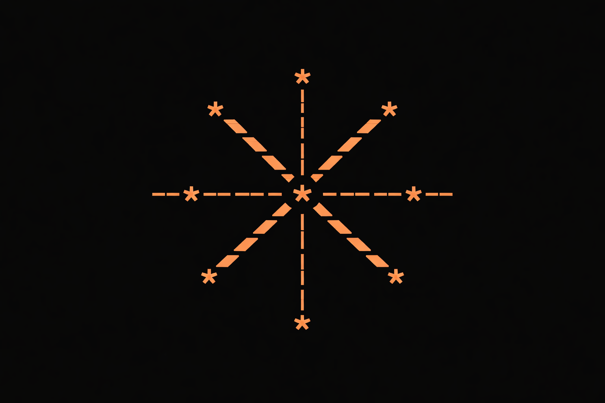

\


```
   ____ _                 _        ____             _                            
  / ___| | __ _ _   _  __| | ___  | __ )  __ _  ___| | ___ __ ___   ___  ___    
 | |   | |/ _` | | | |/ _` |/ _ \ |  _ \ / _` |/ __| |/ / '__/ _ \ / _ \/ __|   
 | |___| | (_| | |_| | (_| |  __/ | |_) | (_| | (__|   <| | | (_) | (_) \__ \   
  \____|_|\__,_|\__,_|\__,_|\___| |____/ \__,_|\___|_|\_\_|  \___/ \___/|___/   

  CONTAINMENT CLI · ROOM-GRAPH INDEXER · MEMORY SCOPED EXECUTION
```

# Claude Backrooms

Claude Backrooms is a terminal-first **room-scoped execution + indexing system** for LLM interactions.

It is not a chat UI.
It is not a prompt playground.

It is a **bounded environment runner** where interactions are written as events inside "rooms",
rooms mutate over time, and the output of rooms is indexed into a navigable graph.

---

## What this repo gives you

- A real CLI (`claude-backrooms`) with:
  - room creation / sealing / forking
  - event journaling (inputs, outputs, violations)
  - rule-set validation
  - mutation + entropy tracking
  - room graph export (Mermaid + JSON)
- A clean schema layer (Zod) for room manifests and event logs
- A pluggable "LLM adapter" interface
  - comes with a **Mock Adapter** so the system runs locally without keys
  - you can wire in Claude via an adapter file when you want

---

## Quickstart

### 1) Install

```bash
git clone <this-repo>
cd claude-backrooms
npm i
```

### 2) Run in dev

```bash
npm run dev -- --help
```

### 3) Initialize a backrooms workspace

This creates `data/` locally for rooms and indexes.

```bash
npm run dev -- init
```

### 4) Create a room

```bash
npm run dev -- room create \
  --id L3-ARCHIVE-17 \
  --ruleset archival_only \
  --memory persistent \
  --allowed summaries,indexes \
  --forbidden speculation,creativity
```

### 5) Enter the room and inject input

```bash
npm run dev -- enter L3-ARCHIVE-17 --in "Index this artifact: ./docs/ontology.md"
```

By default, the system uses a **Mock Adapter** and will still generate deterministic outputs and logs.
When you integrate Claude, the same flow stays intact.

### 6) Export the room graph

```bash
npm run dev -- graph export --format mermaid
```

Output is written to:

- `data/graph/rooms.json`
- `data/graph/rooms.mmd`

---

## CLI Commands

```bash
claude-backrooms init
claude-backrooms room create [options]
claude-backrooms room list
claude-backrooms room show <roomId>
claude-backrooms room seal <roomId>
claude-backrooms room fork <roomId> --new <newId>
claude-backrooms enter <roomId> --in <text> [--adapter mock|claude]
claude-backrooms graph export [--format json|mermaid]
claude-backrooms validate <roomId>
```

---

## Room model (short)

A room is a manifest + an append-only event log.

- `room.yaml` (identity + constraints)
- `events.ndjson` (journal of interactions)
- `state.json` (derived state: entropy, mutation, counters, last summary)

Rooms can fork into adjacent rooms. Forking copies constraints and inherits a portion of state.

Rooms can be sealed. Sealed rooms are immutable: you can read and index, but you cannot enter.

---

## Data layout

```
data/
  rooms/
    L3-ARCHIVE-17/
      room.yaml
      events.ndjson
      state.json
  graph/
    rooms.json
    rooms.mmd
```

---

## Adapters

Adapters live in `src/adapters/`.

- `mock` adapter: deterministic, local, no network
- `claude` adapter: skeleton interface (you implement the API call)

Adapters must implement:

- `generate(room, input, history) -> output`
- `classify(output) -> { violations: string[] }`

---

## Philosophy

Rooms are not "contexts".

Rooms are containment boundaries.

- Constraints are enforced.
- Violations are logged.
- Entropy is a function of repeated failure, constraint tension, and mutation depth.
- Output is indexed as behavior, not as "answers".

If you want to read the deeper model:
- `docs/backrooms-principles.md`
- `docs/failure-taxonomy.md`
- `docs/ontology.md`

---

## Roadmap (realistic)

- sqlite storage option (instead of NDJSON)
- room-to-room references (sealed room pointers)
- hallucination sinks + adversarial mirrors as standard rule-sets
- TUI mode (ncurses-style)

---

## Disclaimer

This repository ships with a local adapter and does not call external APIs by default.
If you integrate Claude, follow your provider's policies and terms.

